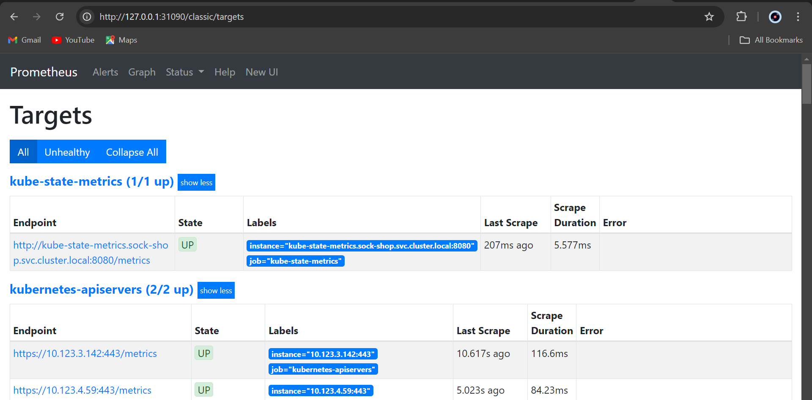
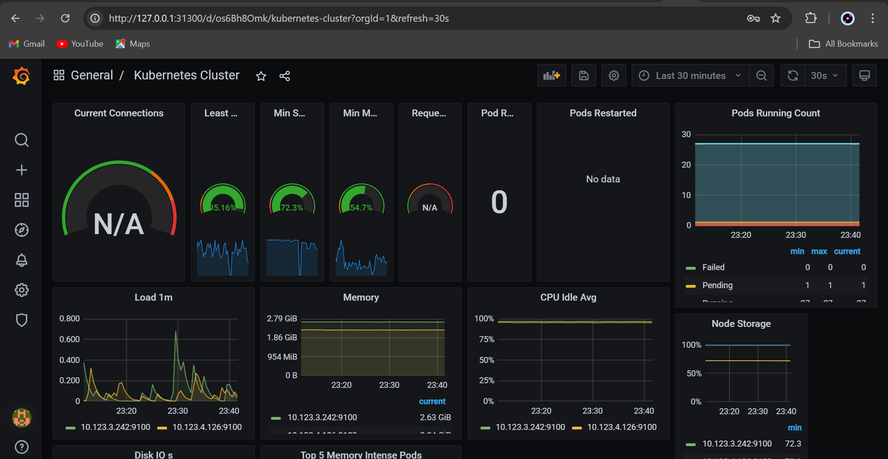

# Socks Shop Microservices-based Application Deployment on Kubernetes using IaC.

## Project Overview
The objective is to deploy a microservices-based application, specifically the Socks Shop, using a modern Infrastructure as Code (IaaC) approach which will provision the necessary resources on AWS. The deployment leverages Kubernetes, Prometheus for monitoring, Grafana for visualization, Github actions for ci/cd pipelines, and ensures secure access via HTTPS using Let's Encrypt.

The project will leverage Terraform for infrastructure provisioning, GitHub Actions for the deployment pipeline, Kubernetes for container orchestration, Helm for package management, Prometheus for monitoring, the ELK Stack for logging, and Ansible for security.

## Project Requirements
Before you begin, ensure you have the following tools installed: 

1. Helm

2. kubectl

3. Terraform

4. Ansible

5. A Kubernetes cluster (e.g., EKS, GKE, AKS, or Minikube)

# Prerequisistes

The project will leverage the following tools and technologies:

Terraform: Infrastructure as code tool that automates cloud resource management using a declarative language.

AWS Account: Necessary for creating cloud infrastructure components like VPCs, subnets, security groups, and an EKS cluster.

GitHub Actions: Automates the deployment pipeline for the Socks Shop application to a Kubernetes cluster.

Kubernetes: Orchestrates the deployment, scaling, and management of containerized applications.

Helm: Simplifies the management of Kubernetes applications through a package manager.

Prometheus: Provides monitoring and alerting by collecting and analyzing metrics from various targets.

ELK Stack: A toolset for log collection, searching, analysis, and visualization in real time.

Let's Encrypt: Offers free SSL/TLS certificates to secure web applications. ( Didn't use let's encrtypt)

Socks Shop Application: A reference microservices-based e-commerce platform for showcasing cloud-native technologies.

## Getting Started
Socks Shop Resources:  [View Resources](https://github.com/microservices-demo/microservices-demo.github.io)  

Demo: [Explore Demo](https://github.com/microservices-demo/microservices-demo/tree/master)

### Infrastructure Provisioning:

1. We'll use Terraform to provision AWS resources, including VPCs, subnets, security groups, and an EKS cluster, ensuring a consistent and reproducible setup.

    Prerequisites:

     Terraform: Install Terraform to manage infrastructure. [Download Terraform](https://developer.hashicorp.com/terraform/install)

     AWS CLI: Install the AWS CLI for managing AWS resources. [AWS CLI Installation Guide](https://aws.amazon.com/cli/)

     ## Steps:
     1. Initialize terraform: run command `terraform init` in your working directory. .

     2. Then apply the content of the main.tf file (provision.tf as specified in my project) using the `terraform apply --auto-approve` command. This creates the resources needed e.g EKS and VPC (including their components) in the AWS console.

     3. Ensure kubectl is installed. Note that kubectl is the command line tool to interact with kubernetes cluster.[Install Kubectl](https://kubernetes.io/docs/tasks/tools/) 

     4. Link kubectl to AWS account using the `aws eks update-kubeconfig --name sock-shop --region us-east-1` command

     5. Navigate to the K8 directory and deploy the sock-shop app to the AWS EKS. 

     6. After applying the deployment file, the sockshop app is deployed on the Eks cluster.

     7. Apply the manifest filesvfor bothe monitoring and alert.

     

     8. Apply the ingress file: the file is found in the k8 directory and it allows you to manage external access to services within your cluster, typically HTTP and HTTPS. 

     8. To list all the services within the sock-shop namespace in your Kubernetes cluster used the `kubectl get services -n sock-shop`. This targets the sock-shop namespace and outputs the services running.

     9. Note that the usage of  Port forwarding in Kubernetes allows you to forward traffic from a local port on your machine to a port on a pod within your Kubernetes cluster. This is useful for accessing services running inside the cluster without exposing them externally. Therefore, some important srvices were targetted for portforwarding to reach the desired goal.

     10. Portfoward front-end service..   The result :
     .

     11. Portfoward prometheus-svc. The result :
     

     12. Portfoward grafana : this is done using the `kubectl port-forward service/grafana-svc 31300:80 -n sock-shop` command. Thus the result: 
       . 

## Conclusion 
   This README.md provides a comprehensive guide to setting up the Socks Shop application using Kubernetes, Prometheus, and Grafana, with an emphasis on automation, monitoring, and security. 
